# [tomcat工作原理](https://juejin.im/post/58eb5fdda0bb9f00692a78fc)

## Tomcat是什么

- 开源的 Java Web 应用服务器，实现了 Java EE(Java Platform Enterprise Edition)的部分技术规范。

## Servlet容器

### Tomcat 组成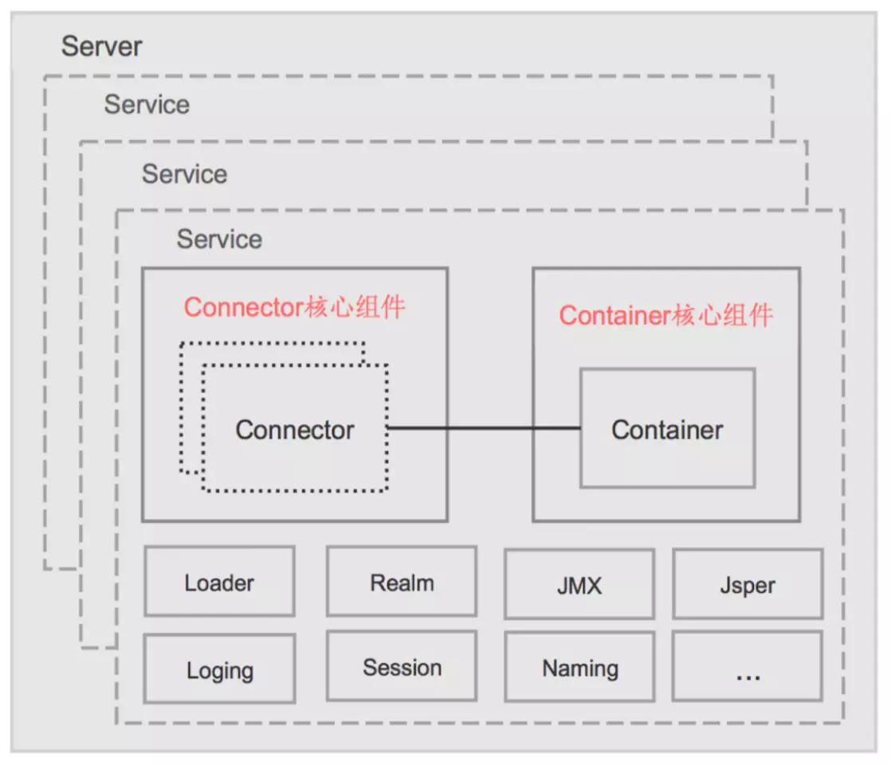

- 主要由 Container 和 Connector 以及相关组件构成。
- **Server**：
  - 指的就是整个 Tomcat 服 务器，包含多组服务，负责管理和 启动各个 Service，同时监听 8005 端口发过来的 shutdown 命令，用 于关闭整个容器 ；
- **Service**：
  - Tomcat 封装的、对外提 供完整的、基于组件的 web 服务， 包含 Connectors、Container 两个 核心组件，以及多个功能组件，各 个 Service 之间是独立的，但是共享 同一 JVM 的资源 ；
- **Connector**：
  - Tomcat 与外部世界的连接器，监听固定端口接收外部请求，传递给 Container，并 将 Container 处理的结果返回给外部；
- **Container**：
  - Catalina，Servlet 容器，内部有多层容器组成，用于管理 Servlet 生命周期，调用 servlet 相关方法。
- **Loader**：
  - 封装了 Java ClassLoader，用于 Container 加载类文件； Realm：Tomcat 中为 web 应用程序提供访问认证和角色管理的机制；
- **JMX**：
  - Java SE 中定义技术规范，是一个为应用程序、设备、系统等植入管理功能的框架，通过 JMX 可以远程监控 Tomcat 的运行状态；
- **Jasper**：
  - Tomcat 的 Jsp 解析引擎，用于将 Jsp 转换成 Java 文件，并编译成 class 文件。
-  **Session**：
  - 负责管理和创建 session，以及 Session 的持久化(可自定义)，支持 session 的集群。
- **Pipeline**：
  - 在容器中充当管道的作用，管道中可以设置各种 valve(阀门)，请求和响应在经由管 道中各个阀门处理，提供了一种灵活可配置的处理请求和响应的机制。
- **Naming**：
  - 命名服务，JNDI， Java 命名和目录接口，是一组在 Java 应用中访问命名和目录服务的 API。
  - 命名服务将名称和对象联系起来，使得我们可以用名称访问对象，目录服务也是一种命名 服务，对象不但有名称，还有属性。
  - Tomcat 中可以使用 JNDI 定义数据源、配置信息，用于开发 与部署的分离。

---

### Container组成

- Engine：
  - Servlet 的顶层容器，包含一 个或多个 Host 子容器；
- Host：
  - 虚拟主机，负责 web 应用的部署和 Context 的创建；
- Context：
  - Web 应用上下文，包含多个 Wrapper，负责 web 配置的解析、管 理所有的 Web 资源；
- Wrapper：
  - 最底层的容器，是对 Servlet 的封装，负责 Servlet 实例的创建、执行和销毁。

---

### 生命周期管理

- Tomcat 为了方便管理组件和容器的生命周期，定义了从创建、启动、到停止、销毁共 12 中状态，tomcat 生命周期管理了内部状态变化的规则控制，组件和容器只需实现相应的生命周期方法即可完成各生命周期内的操作(initInternal、startInternal、stopInternal、 destroyInternal)；
- 比如执行初始化操作时，会判断当前状态是否 New：
  - 如果不是则抛出生命周期异常。
  - 是的话则设置当前状态为 Initializing，并执行 initInternal 方法，由子类实现，方法执行成功则设置当前状态为 Initialized，执行失败则设置为 Failed 状态。
- Tomcat 的生命周期管理引入了事件机制，在组件或容器的生命周期状态发生变化时会通 知事件监听器，监听器通过判断事件的类型来进行相应的操作。
- 事件监听器的添加可以在 server.xml 文件中进行配置。
- Tomcat 各类容器的配置过程就是通过添加 listener 的方式来进行的，从而达到配置逻辑与容器的解耦。如 EngineConfig、HostConfig、ContextConfig。
  - EngineConfig：主要打印启动和停止日志。
  - HostConfig：主要处理部署应用，解析应用 META-INF/context.xml 并创建应用的 Context。
  - ContextConfig：主要解析并合并 web.xml，扫描应用的各类 web 资源 (filter、servlet、listener)。

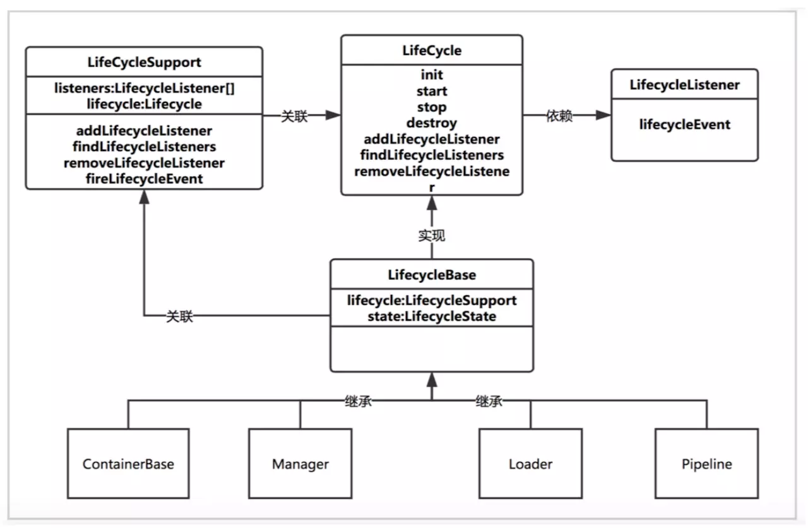

---

### Tomcat 的启动过程

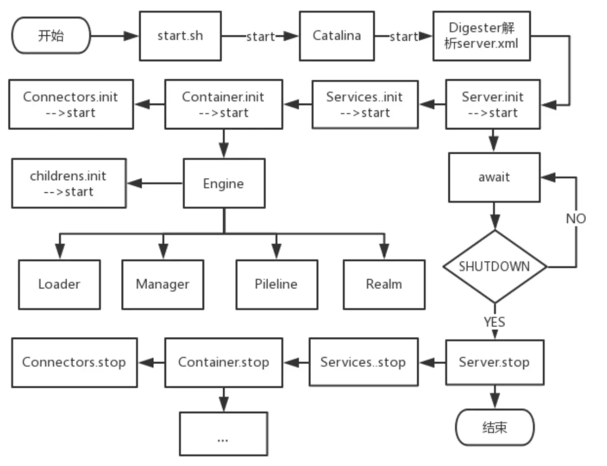

- 启动从 Tomcat 提供的 start.sh 脚本开始，shell 脚本会调用 Bootstrap 的 main 方法，实际 调用了 Catalina 相应的 load、start 方法。
- load 方法会通过 Digester 进行 config/server.xml 的解析，在解析的过程中会根据 xml 中的关系和配置信息来创建容器，并设置相关的属性。接着 Catalina 会调用 StandardServer 的 init 和 start 方法进行容器的初始化和启动。
- 按照 xml 的配置关系，server 的子元素是 service，service 的子元素是顶层容器 Engine，每层容器有持有自己的子容器，而这些元素都实现了生命周期管理 的各个方法，因此就很容易的完成整个容器的启动、关闭等生命周期的管理。
- StandardServer 完成 init 和 start 方法调用后，会一直监听来自 8005 端口(可配置)，如果接收 到 shutdown 命令，则会退出循环监听，执行后续的 stop 和 destroy 方法，完成 Tomcat 容器的 关闭。同时也会调用 JVM 的 Runtime.getRuntime()﴿.addShutdownHook 方法，在虚拟机意外退 出的时候来关闭容器。
- 所有容器都是继承自 ContainerBase，基类中封装了容器中的重复工作，负责启动容器相关的组 件 Loader、Logger、Manager、Cluster、Pipeline，启动子容器(线程池并发启动子容器，通过 线程池 submit 多个线程，调用后返回 Future 对象，线程内部启动子容器，接着调用 Future 对象 的 get 方法来等待执行结果)。

---

### Web 应用的部署方式

- 注：

  - catalina.home：安装目录；catalina.base：工作目录；默认值 user.dir。

- Server.xml 配置 Host 元素，指定 appBase 属性，默认`\$catalina.base/webapps/`。

- Server.xml 配置 Context 元素，指定 docBase，元素，指定 web 应用的路径。

- 自定义配置：在`\$catalina.base/EngineName/HostName/XXX.xml`配置 Context 元素。

- HostConfig 监听了 StandardHost 容器的事件，在 start 方法中解析上述配置文件：

  - 扫描 appbase 路径下的所有文件夹和 war 包，解析各个应用的 META-INF/context.xml，并 创建 StandardContext，并将 Context 加入到 Host 的子容器中。
  - 解析`$catalina.base/EngineName/HostName/`下的所有 Context 配置，找到相应 web 应 用的位置，解析各个应用的 META-INF/context.xml，并创建 StandardContext，并将 Context 加入到 Host 的子容器中。

- 注：

  - HostConfig 并没有实际解析 Context.xml，而是在 ContextConfig 中进行的。
  - HostConfig 中会定期检查 watched 资源文件(context.xml 配置文件)。

- ContextConfig 解析 context.xml 顺序：

  - 先解析全局的配置 `config/context.xml` 。
  - 然后解析 Host 的默认配置 `EngineName/HostName/context.xml.default` 。
  - 最后解析应用的 `META-INF/context.xml` 。

- ContextConfig 解析 web.xml 顺序：

  - 先解析全局的配置 `config/web.xml` 。

    然后解析 Host 的默认配置 `EngineName/HostName/web.xml.default` 接着解析应用的 `MEB-INF/web.xml` 。

    扫描应用` WEB-INF/lib/`下的 jar 文件，解析其中的 `META-INF/web-fragment.xml` 最后合并 xml 封装成 WebXml，并设置 Context。

- 注：

  - 扫描 web 应用和 jar 中的注解(Filter、Listener、Servlet)就是上述步骤中进行的。
  - 容器的定期执行：backgroundProcess，由 ContainerBase 来实现的，并且只有在顶层容器 中才会开启线程。(backgroundProcessorDelay=10 标志位来控制)。

---

### Servlet 生命周期

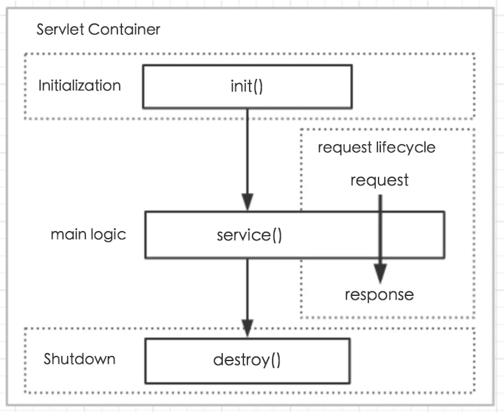

- Servlet 是用 Java 编写的服务器端程序。其主要功能在于交互式地浏览和修改数据，生成动态 Web 内容。
- Servlet创建到销毁的过程：
  1. 请求到达 server 端，server 根据 url 映射到相应的 Servlet。
  2. 判断 Servlet 实例是否存在，不存在则加载和实例化 Servlet 并调用 init 方法。
  3. Server 分别创建 Request 和 Response 对象，调用 Servlet 实例的 service 方法(service 方法 内部会根据 http 请求方法类型调用相应的 doXXX 方法)。
  4. doXXX 方法内为业务逻辑实现，从 Request 对象获取请求参数，处理完毕之后将结果通过 response 对象返回给调用方。
  5. 当 Server 不再需要 Servlet 时(一般当 Server 关闭时)，Server 调用 Servlet 的 destroy() 方法。
- load on startup
  - 当值为 0 或者大于 0 时，表示容器在应用启动时就加载这个 servlet；
  - 当是一个负数时或者没有指定时，则指示容器在该 servlet 被选择时才加载；
  - 正数的值越小，启动该 servlet 的优先级越高。
- single thread model
  - 每次访问 servlet，新建 servlet 实体对象，但并不能保证线程安全，同时 tomcat 会限制 servlet 的实例数。
  - 最佳实践：不要使用该模型，servlet 中不要有全局变量。

##### 请求处理过程

1. 根据 server.xml 配置的指定的 connector 以及端口监听 http、或者 ajp 请求。
2. 请求到来时建立连接，解析请求参数，创建 Request 和 Response 对象，调用顶层容器 pipeline 的 invoke 方法。
3. 容器之间层层调用，最终调用业务 servlet 的 service 方法。
4. Connector 将 response 流中的数据写到 socket 中。

##### Pipeline 与 Valve

- Pipeline 可以理解为现实中的管道，Valve 为管道中的阀门，Request 和 Response 对象在管道中经过各个阀门的处理和控制。
- 每个容器的管道中都有一个必不可少的 basic valve，其他的都是可选的，basic valve 在管道中最后调用，同时负责调用子容器的第一个 valve。
- Valve 中主要的三个方法：setNext、getNext、invoke；valve 之间的关系是单向链式结构，本身 invoke 方法中会调用下一个 valve 的 invoke 方法。
- 各层容器对应的 basic valve 分别是 StandardEngineValve、StandardHostValve、 StandardContextValve、StandardWrapperValve。

## JSP引擎

### JSP 生命周期

- 编译阶段：servlet 容器编译 servlet 源文件，生成 servlet 类。
- 初始化阶段：加载与 JSP 对应的 servlet 类，创建其实例，并调用它的初始化方法。
- 执行阶段：调用与 JSP 对应的 servlet 实例的服务方法。
- 销毁阶段：调用与 JSP 对应的 servlet 实例的销毁方法，然后销毁 servlet 实例。

### JSP元素

- 代码片段：`<% 代码片段 %>`
- JSP声明：`<%! declaration; [ declaration; ]+ ... %>`
- JSP表达式：`<%= 表达式 %>`
- JSP注释：`<%-- 注释 --%>`
  JSP指令：`<%@ directive attribute=“value” %>`
- JSP行为：
- HTML元素： html/head/body/div/p/…
- JSP隐式对象：request、response、out、session、application、config、pageContext、page、Exception。

### Jsp 解析过程

- 代码片段：在_jspService()方法内直接输出。
- JSP 声明：在 servlet 类中进行输出。
- JSP 表达式：在_jspService()方法内直接输出。
- JSP 注释：直接忽略,不输出。
- JSP 指令：根据不同指令进行区分：

  - include:对引入的文件进行解析；
  - page 相关的属性会做为 JSP 的属性，影响的是解析和请求处理时的行为。
- JSP 行为：不同的行为有不同的处理方式，`jsp:useBean` 为例，会从 pageContext 根据 scope 的 类别获取 bean 对象，如果没有会创建 bean，同时存到相应 scope 的 pageContext 中。
- HTML：在`_jspService()`方法内直接输出。
- JSP 隐式对象：在`_jspService()`方法会进行声明，只能在方法中使用。

## Connector

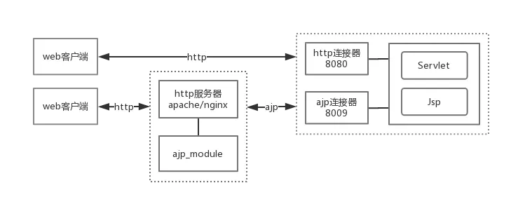

- HTTP：HTTP 是超文本传输协议，是客户端浏览器或其他程序与 Web 服务器之间的应用层通信协议。
- AJP：Apache JServ 协议(AJP)是一种二进制协议，专门代理从 Web 服务器到位于后端的应用程序服务器的入站请求。

### 阻塞 IO

### 非阻塞 IO

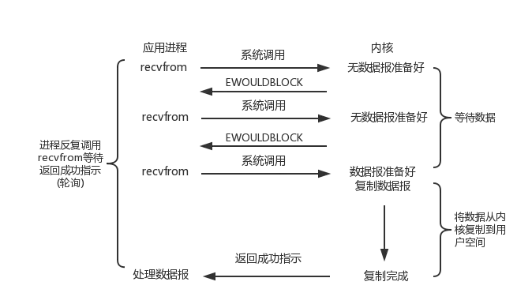

### IO多路复用

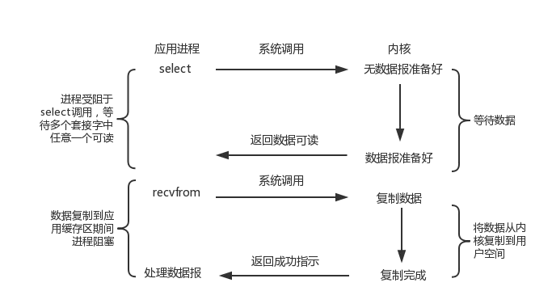

- 阻塞与非阻塞的区别在于进行读操作和写操作的系统调用时，如果此时内核态没有数据可读或者没有缓冲空间可写时，是否阻塞。
- IO多路复用的好处在于可同时监听多个socket的可读和可写事件，这样就能使得应用可以同时监听多个socket，释放了应用线程资源。

### Tomcat各类Connector对比

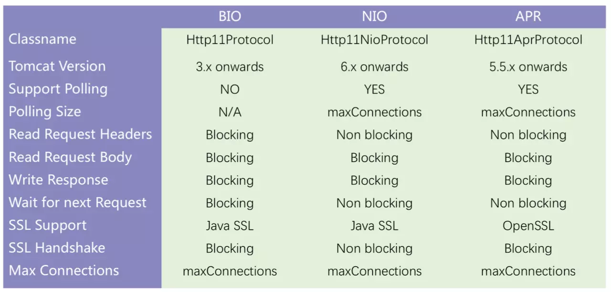

- Connector的实现模式有三种，分别是BIO、NIO、APR，可以在server.xml中指定。
  - JIO：用java.io编写的TCP模块，阻塞IO。
  - NIO：用java.nio编写的TCP模块，非阻塞IO，（IO多路复用）。
  - APR：全称Apache Portable Runtime，使用JNI的方式来进行读取文件以及进行网络传输。
- Apache Portable Runtime是一个高度可移植的库，它是Apache HTTP Server 2.x的核心。 APR具有许多用途，包括访问高级IO功能（如sendfile，epoll和OpenSSL），操作系统级功能（随机数生成，系统状态等）和本地进程处理（共享内存，NT管道和Unix套接字）。
- 表格中字段含义说明：
  - Support Polling：是否支持基于IO多路复用的socket事件轮询。
  - Polling Size：轮询的最大连接数。
  - Wait for next Request：在等待下一个请求时，处理线程是否释放，BIO是没有释放的，所以在keep-alive=true的情况下处理的并发连接数有限。
  - Read Request Headers：由于request header数据较少，可以由容器提前解析完毕，不需要阻塞。
  - Read Request Body：读取request body的数据是应用业务逻辑的事情，同时Servlet的限制，是需要阻塞读取的。
  - Write Response：跟读取request body的逻辑类似，同样需要阻塞写。

### NIO处理相关类

- Poller线程从EventQueue获取PollerEvent，并执行PollerEvent的run方法，调用Selector的select方法，如果有可读的Socket则创建Http11NioProcessor，放入到线程池中执行；
- CoyoteAdapter是Connector到Container的适配器，Http11NioProcessor调用其提供的service方法，内部创建Request和Response对象，并调用最顶层容器的Pipeline中的第一个Valve的invoke方。
- Mapper主要处理http url 到servlet的映射规则的解析，对外提供map方法。

### NIO Connector主要参数

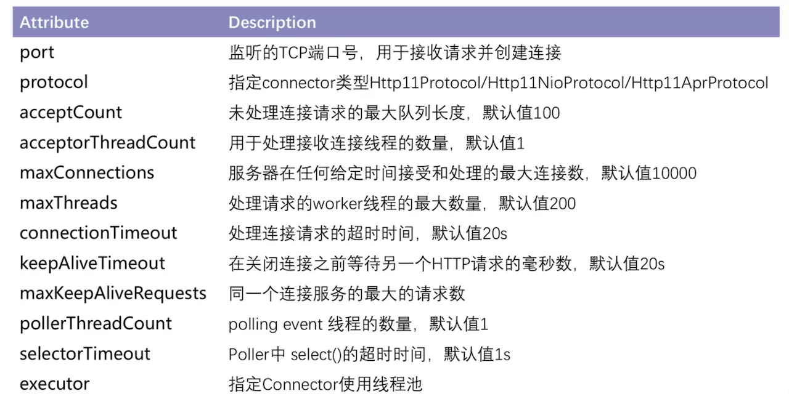

## Comet

- Comet是一种用于web的推送技术，能使服务器实时地将更新的信息传送到客户端，而无须客户端发出请求。
- 在WebSocket出来之前，如果不适用comet，只能通过浏览器端轮询Server来模拟实现服务器端推送。
- Comet支持servlet异步处理IO，当连接上数据可读时触发事件，并异步写数据(阻塞)。

- Tomcat要实现Comet，只需继承HttpServlet同时，实现CometProcessor接口：
  - Begin：新的请求连接接入调用，可进行与Request和Response相关的对象初始化操作，并保存response对象，用于后续写入数据。
  - Read：请求连接有数据可读时调用。
  - End：当数据可用时，如果读取到文件结束或者response被关闭时则被调用。
  - Error：在连接上发生异常时调用，数据读取异常、连接断开、处理异常、socket超时。

### Note：

- Read：在post请求有数据，但在begin事件中没有处理，则会调用read，如果read没有读取数据，在会触发Error回调，关闭socket。
- End：当socket超时，并且response被关闭时也会调用；server被关闭时调用。
- Error：除了socket超时不会关闭socket，其他都会关闭socket。
- End和Error时间触发时应关闭当前comet会话，即调用CometEvent的close方法。
- 在事件触发时要做好线程安全的操作。

## 异步Servlet

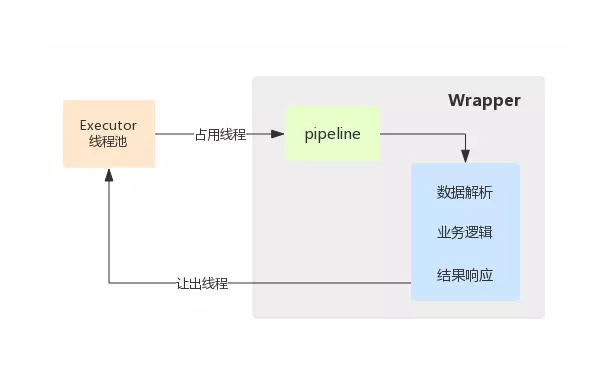

- 传统流程：
  - 首先，Servlet 接收到请求之后，request数据解析；
  - 接着，调用业务接口的某些方法，以完成业务处理；
  - 最后，根据处理的结果提交响应，Servlet 线程结束。

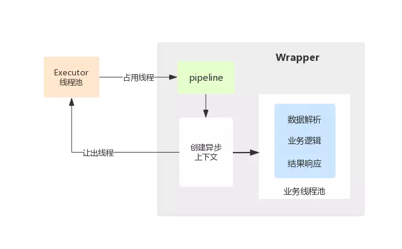

- 异步处理流程：
  - 客户端发送一个请求。
  - Servlet容器分配一个线程来处理容器中的一个servlet。
  - servlet调用`request.startAsync()`，保存AsyncContext，然后返回。
  - 任何方式存在的容器线程都将退出，但是response仍然保持开放。
  - 业务线程使用保存的AsyncContext来完成响应（线程池）。
  - 客户端收到响应。
- Servlet 线程将请求转交给一个异步线程来执行业务处理，线程本身返回至容器，此时 Servlet 还没有生成响应数据，异步线程处理完业务以后，可以直接生成响应数据（异步线程拥有 ServletRequest 和 ServletResponse 对象的引用）。

### 为什么web应用中支持异步？

- 推出异步，主要是针对那些比较耗时的请求：比如一次缓慢的数据库查询，一次外部REST API调用, 或者是其他一些I/O密集型操作。这种耗时的请求会很快的耗光Servlet容器的线程池，继而影响可扩展性。
- Note：从客户端的角度来看，request仍然像任何其他的HTTP的request-response交互一样，只是耗费了更长的时间而已。

### 异步事件监听

- onStartAsync：Request调用startAsync方法时触发。
- onComplete：syncContext调用complete方法时触发
- onError：处理请求的过程出现异常时触发。
- onTimeout：socket超时触发。
- Note ：
  - onError/ onTimeout触发后，会紧接着回调onComplete。
  - onComplete 执行后，就不可再操作request和response。