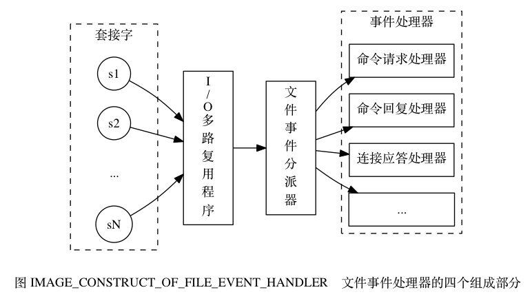

# [Redis文件事件处理器](http://redisbook.com/preview/event/file_event.html)

- Redis 基于**Reactor模式**开发了自己的网络事件处理器： 这个处理器被称为文件事件处理器。
  - 文件事件处理器使用**I/O 多路复用**程序来同时监听多个套接字， 并根据套接字目前执行的任务来为套接字关联不同的事件处理器。
  - 当被监听的套接字准备好执行连接应答、读取、写入、关闭等操作时， 与操作相对应的文件事件就会产生， 这时文件事件处理器就会调用套接字之前关联好的事件处理器来处理这些事件。
- 虽然文件事件处理器以单线程方式运行， 但通过使用 I/O 多路复用程序来监听多个套接字， 文件事件处理器既实现了高性能的网络通信模型， 又可以很好地与 Redis 服务器中其他同样以单线程方式运行的模块进行对接， 这保持了 Redis 内部单线程设计的简单性。

## 文件事件处理器的构成

- 下图展示了文件事件处理器的四个组成部分， 它们分别是套接字、 I/O 多路复用程序、 文件事件分派器（dispatcher）、 以及事件处理器。

- 文件事件是对套接字操作的抽象， 每当一个套接字准备好执行连接应答、写入、读取、关闭等操作时， 就会产生一个文件事件。 因为一个服务器通常会连接多个套接字， 所以多个文件事件有可能会并发地出现。
- I/O 多路复用程序负责监听多个套接字， 并向文件事件分派器传送那些产生了事件的套接字。
- 尽管多个文件事件可能会并发地出现， 但 I/O 多路复用程序总是会将所有产生事件的套接字都入队到一个队列里面， 然后通过这个队列， 以有序、同步、每次一个套接字的方式向文件事件分派器传送套接字： 当上一个套接字产生的事件被处理完毕之后（该套接字为事件所关联的事件处理器执行完毕）， I/O 多路复用程序才会继续向文件事件分派器传送下一个套接字， 如下图所示。

- 文件事件分派器接收 I/O 多路复用程序传来的套接字， 并根据套接字产生的事件的类型， 调用相应的事件处理器。
- 服务器会为执行不同任务的套接字关联不同的事件处理器， 这些处理器是一个个函数， 它们定义了某个事件发生时， 服务器应该执行的动作。