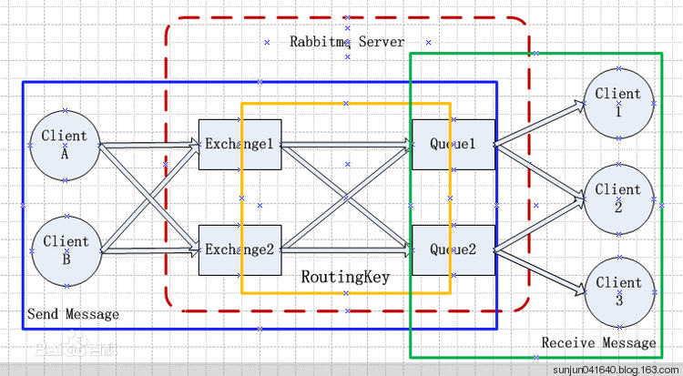

# [常用消息队列](http://blog.csdn.net/xqnode/article/details/78029726)

- 一般商用的容器，比如WebLogic，JBoss，都支持JMS标准，开发上很方便。但免费的比如Tomcat，Jetty等则需要使用第三方的消息中间件。本部分内容介绍常用的消息中间件（Active MQ,Rabbit MQ，Zero MQ,Kafka）以及他们的特点。

---

## ActiveMQ

- ActiveMQ 是Apache出品，最流行的，能力强劲的开源消息总线。ActiveMQ 是一个完全支持JMS1.1和J2EE 1.4规范的 JMS Provider实现，尽管JMS规范出台已经是很久的事情了，但是JMS在当今的J2EE应用中间仍然扮演着特殊的地位。
- ActiveMQ特性如下：
  1. 多种语言和协议编写客户端。语言: Java,C,C++,C#,Ruby,Perl,Python,PHP。应用协议： OpenWire,Stomp REST,WS Notification,XMPP,AMQP
  2. 完全支持JMS1.1和J2EE 1.4规范 （持久化，XA消息，事务)
  3. 对Spring的支持，ActiveMQ可以很容易内嵌到使用Spring的系统里面去，而且也支持Spring2.0的特性
  4. 通过了常见J2EE服务器（如 Geronimo,JBoss 4,GlassFish,WebLogic)的测试，其中通过JCA 1.5 resource adaptors的配置，可以让ActiveMQ可以自动的部署到任何兼容J2EE 1.4 商业服务器上
  5. 支持多种传送协议：in-VM,TCP,SSL,NIO,UDP,JGroups,JXTA
  6. 支持通过JDBC和journal提供高速的消息持久化
  7. 从设计上保证了高性能的集群，客户端-服务器，点对点
  8. 支持Ajax
  9. 支持与Axis的整合
  10. 可以很容易得调用内嵌JMS provider，进行测试

---

### [Redis](http://blog.csdn.net/sunxinhere/article/details/7968886)

- 是一个Key-Value的NoSQL数据库，开发维护很活跃，虽然它是一个Key-Value数据库存储系统，但它本身支持MQ功能，所以完全可以当做一个轻量级的队列服务来使用。对于RabbitMQ和Redis的入队和出队操作，各执行100万次，每10万次记录一次执行时间。测试数据分为128Bytes、512Bytes、1K和10K四个不同大小的数据。
- 实验表明：入队时，当数据比较小时Redis的性能要高于RabbitMQ，而如果数据大小超过了10K，Redis则慢的无法忍受；出队时，无论数据大小，Redis都表现出非常好的性能，而RabbitMQ的出队性能则远低于Redis。

|          | 入队  |       |       |      | 出队  |       |       |      |
| -------- | ----- | ----- | ----- | ---- | ----- | ----- | ----- | ---- |
| 数据大小 | 128B  | 512B  | 1K    | 10K  | 128B  | 512B  | 1K    | 10K  |
| Redis    | 16088 | 15961 | 17094 | 25   | 15955 | 20449 | 18098 | 9355 |
| RabbitMQ | 10627 | 9916  | 9370  | 2366 | 3219  | 3174  | 2982  | 1588 |

---

## RabbitMQ

- RabbitMQ是流行的开源消息队列系统，用erlang语言开发。RabbitMQ是AMQP（高级消息队列协议）的标准实现。支持多种客户端，如：Python、Ruby、.NET、Java、JMS、C、PHP、ActionScript、XMPP、STOMP等，支持AJAX，持久化。用于在分布式系统中存储转发消息，在易用性、扩展性、高可用性等方面表现不俗。
- 结构图如下：

- 几个重要概念：
  - Broker：简单来说就是消息队列服务器实体。
  - Exchange：消息交换机，它指定消息按什么规则，路由到哪个队列。
  - Queue：消息队列载体，每个消息都会被投入到一个或多个队列。
  - Binding：绑定，它的作用就是把exchange和queue按照路由规则绑定起来。
  - Routing Key：路由关键字，exchange根据这个关键字进行消息投递。
  - vhost：虚拟主机，一个broker里可以开设多个vhost，用作不同用户的权限分离。
  - producer：消息生产者，就是投递消息的程序。
  - consumer：消息消费者，就是接受消息的程序。
  - channel：消息通道，在客户端的每个连接里，可建立多个channel，每个channel代表一个会话任务。
- 消息队列的使用过程，如下：
  1. 客户端连接到消息队列服务器，打开一个channel。
  2. 客户端声明一个exchange，并设置相关属性。
  3. 客户端声明一个queue，并设置相关属性。
  4. 客户端使用routing key，在exchange和queue之间建立好绑定关系。
  5. 客户端投递消息到exchange。
- exchange接收到消息后，就根据消息的key和已经设置的binding，进行消息路由，将消息投递到一个或多个队列里。

---

### ZeroMQ

- 号称史上最快的消息队列，它实际类似于Socket的一系列接口，他跟Socket的区别是：普通的socket是端到端的（1:1的关系），而ZMQ却是可以N：M 的关系，人们对BSD套接字的了解较多的是点对点的连接，点对点连接需要显式地建立连接、销毁连接、选择协议（TCP/UDP）和处理错误等，而ZMQ屏蔽了这些细节，让你的网络编程更为简单。ZMQ用于node与node间的通信，node可以是主机或者是进程。
- 特点是：
  - 高性能，非持久化；
  - 跨平台：支持Linux、Windows、OS X等。
  - 多语言支持； C、C++、Java、.NET、Python等30多种开发语言。
  - 可单独部署或集成到应用中使用；
  - 可作为Socket通信库使用。
- 与RabbitMQ相比，ZMQ并不像是一个传统意义上的消息队列服务器，事实上，它也根本不是一个服务器，更像一个底层的网络通讯库，在Socket API之上做了一层封装，将网络通讯、进程通讯和线程通讯抽象为统一的API接口。支持“Request-Reply “，”Publisher-Subscriber“，”Parallel Pipeline”三种基本模型和扩展模型。
- ZeroMQ高性能设计要点：
  1. 无锁的队列模型
     - 对于跨线程间的交互（用户端和session）之间的数据交换通道pipe，采用无锁的队列算法CAS；在pipe两端注册有异步事件，在读或者写消息到pipe的时，会自动触发读写事件。
  2. 批量处理的算法
     - 对于传统的消息处理，每个消息在发送和接收的时候，都需要系统的调用，这样对于大量的消息，系统的开销比较大，zeroMQ对于批量的消息，进行了适应性的优化，可以批量的接收和发送消息。
  3. 多核下的线程绑定，无须CPU切换
     - 区别于传统的多线程并发模式，信号量或者临界区， zeroMQ充分利用多核的优势，每个核绑定运行一个工作者线程，避免多线程之间的CPU切换开销。

---

### Kafka

- Kafka是一种高吞吐量的分布式发布订阅消息系统，它可以处理消费者规模的网站中的所有动作流数据。 这种动作（网页浏览，搜索和其他用户的行动）是在现代网络上的许多社会功能的一个关键因素。 这些数据通常是由于吞吐量的要求而通过处理日志和日志聚合来解决。 对于像Hadoop的一样的日志数据和离线分析系统，但又要求实时处理的限制，这是一个可行的解决方案。Kafka的目的是通过Hadoop的并行加载机制来统一线上和离线的消息处理，也是为了通过集群机来提供实时的消费。
- Kafka是一种高吞吐量的分布式发布订阅消息系统，有如下特性：
  - 通过O(1)的磁盘数据结构提供消息的持久化，这种结构对于即使数以TB的消息存储也能够保持长时间的稳定性能。（文件追加的方式写入数据，过期的数据定期删除）
  - 高吞吐量：即使是非常普通的硬件Kafka也可以支持每秒数百万的消息。
  - 支持通过Kafka服务器和消费机集群来分区消息。
  - 支持Hadoop并行数据加载。

##### Kafka相关概念

- Broker：Kafka集群包含一个或多个服务器，这种服务器被称为broker。
- Topic：每条发布到Kafka集群的消息都有一个类别，这个类别被称为Topic。（物理上不同Topic的消息分开存储，逻辑上一个Topic的消息虽然保存于一个或多个broker上但用户只需指定消息的Topic即可生产或消费数据而不必关心数据存于何处）
- Partition：Parition是物理上的概念，每个Topic包含一个或多个Partition。
- Producer：负责发布消息到Kafka broker。
- Consumer：消息消费者，向Kafka broker读取消息的客户端。
- Consumer Group：每个Consumer属于一个特定的Consumer Group（可为每个Consumer指定group name，若不指定group name则属于默认的group）。
- 一般应用在大数据日志处理或对实时性（少量延迟），可靠性（少量丢数据）要求稍低的场景使用。