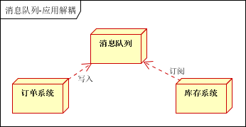
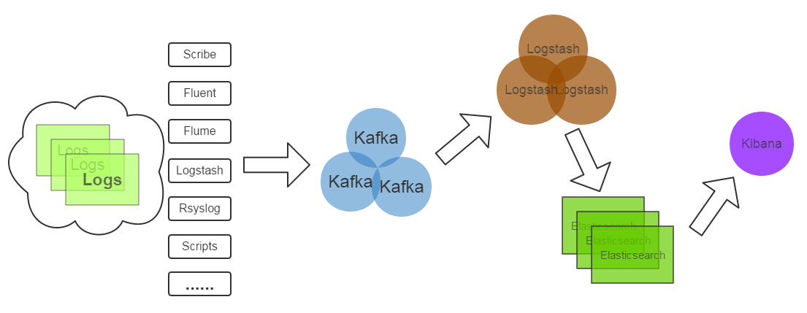

# [消息队列](http://blog.csdn.net/xqnode/article/details/78029726)

## 消息队列概述

- 消息队列中间件是分布式系统中重要的组件，主要解决应用耦合，异步消息，流量削锋等问题。实现高性能，高可用，可伸缩和最终一致性架构。是大型分布式系统不可缺少的中间件。
- 目前在生产环境，使用较多的消息队列有ActiveMQ，RabbitMQ，ZeroMQ，Kafka，MetaMQ，RocketMQ等。

---

## 消息队列应用场景

- 以下介绍消息队列在实际应用中常用的使用场景。异步处理，应用解耦，流量削锋和消息通讯四个场景。

### 异步处理

- 场景说明：用户注册后，需要发注册邮件和注册短信。传统的做法有两种1.串行的方式；2.并行方式。

##### 串行方式

- 注册信息写入数据库成功后，发送注册邮件，再发送注册短信。以上三个任务全部完成后，返回给客户端。

##### 并行方式

- 将注册信息写入数据库成功后，发送注册邮件的同时，发送注册短信。以上三个任务完成后，返回给客户端。与串行的差别是，并行的方式可以提高处理的时间。

- 假设三个业务节点每个使用50毫秒钟，不考虑网络等其他开销，则串行方式的时间是150毫秒，并行的时间可能是100毫秒。

  因为CPU在单位时间内处理的请求数是一定的，假设CPU1秒内吞吐量是100次。则串行方式1秒内CPU可处理的请求量是7次（1000/150）。并行方式处理的请求量是10次（1000/100）。

##### 使用消息队列

- 如以上案例描述，传统的方式系统的性能（并发量，吞吐量，响应时间）会有瓶颈。如何解决这个问题呢？
- 引入消息队列，将不是必须的业务逻辑，异步处理。改造后的架构如下：

- 按照以上约定，用户的响应时间相当于是注册信息写入数据库的时间，也就是50毫秒。注册邮件，发送短信写入消息队列后，直接返回，因此写入消息队列的速度很快，基本可以忽略，因此用户的响应时间可能是50毫秒。因此架构改变后，系统的吞吐量提高到每秒20 QPS。比串行提高了3倍，比并行提高了两倍。

### 应用解耦

- 场景说明：用户下单后，订单系统需要通知库存系统。传统的做法是，订单系统调用库存系统的接口。如下图：

- 传统模式的缺点：
  1. 假如库存系统无法访问，则订单减库存将失败，从而导致订单失败；
  2. 订单系统与库存系统耦合；
- 如何解决以上问题呢？引入应用消息队列后的方案，如下图：

- 订单系统：用户下单后，订单系统完成持久化处理，将消息写入消息队列，返回用户订单下单成功。
- 库存系统：订阅下单的消息，采用拉/推的方式，获取下单信息，库存系统根据下单信息，进行库存操作。
- 假如：在下单时库存系统不能正常使用。也不影响正常下单，因为下单后，订单系统写入消息队列就不再关心其他的后续操作了。实现订单系统与库存系统的应用解耦。

### 流量削锋

- 流量削锋也是消息队列中的常用场景，一般在秒杀或团抢活动中使用广泛。
- 应用场景：秒杀活动，一般会因为流量过大，导致流量暴增，应用挂掉。为解决这个问题，一般需要在应用前端加入消息队列。
  1. 可以控制活动的人数；
  2. 可以缓解短时间内高流量压垮应用；

1. 用户的请求，服务器接收后，首先写入消息队列。假如消息队列长度超过最大数量，则直接抛弃用户请求或跳转到错误页面；
2. 秒杀业务根据消息队列中的请求信息，再做后续处理。

### 日志处理

- 日志处理是指将消息队列用在日志处理中，比如Kafka的应用，解决大量日志传输的问题。架构简化如下：

- 日志采集客户端，负责日志数据采集，定时写受写入Kafka队列；
- Kafka消息队列，负责日志数据的接收，存储和转发；
- 日志处理应用：订阅并消费kafka队列中的日志数据；

##### 例子

- 以下是新浪kafka日志处理应用案例：

1. **Kafka**：接收用户日志的消息队列。
2. **Logstash**：做日志解析，统一成JSON输出给Elasticsearch。
3. **Elasticsearch**：实时日志分析服务的核心技术，一个schemaless，实时的数据存储服务，通过index组织数据，兼具强大的搜索和统计功能。
4. **Kibana**：基于Elasticsearch的数据可视化组件，超强的数据可视化能力是众多公司选择ELK stack的重要原因。

### 消息通讯

- 消息通讯是指，消息队列一般都内置了高效的通信机制，因此也可以用在纯的消息通讯。比如实现点对点消息队列，或者聊天室等。

- 点对点通讯：

  

  - 客户端A和客户端B使用同一队列，进行消息通讯。

- 聊天室通讯：

  

---

## 消息中间件示例

### 电商系统

- 消息队列采用高可用，可持久化的消息中间件。比如Active MQ，Rabbit MQ，Rocket MQ。

1. 应用将主干逻辑处理完成后，写入消息队列。消息发送是否成功可以开启消息的确认模式。（消息队列返回消息接收成功状态后，应用再返回，这样保障消息的完整性）
2. 扩展流程（发短信，配送处理）订阅队列消息。采用推或拉的方式获取消息并处理。
3. 消息将应用解耦的同时，带来了数据一致性问题，可以采用最终一致性方式解决。比如主数据写入数据库，扩展应用根据消息队列，并结合数据库方式实现基于消息队列的后续处理。

### 日志收集系统

- 分为Zookeeper注册中心，日志收集客户端，Kafka集群和Storm集群（OtherApp）四部分组成。
  - Zookeeper注册中心，提出负载均衡和地址查找服务；
  - 日志收集客户端，用于采集应用系统的日志，并将数据推送到kafka队列；
  - Kafka集群：接收，路由，存储，转发等消息处理；
- Storm集群：与OtherApp处于同一级别，采用拉的方式消费队列中的数据；

---

## JMS消息服务

- 讲消息队列就不得不提JMS 。JMS（JAVA Message Service,java消息服务）API是一个消息服务的标准/规范，允许应用程序组件基于JavaEE平台创建、发送、接收和读取消息。它使分布式通信耦合度更低，消息服务更加可靠以及异步性。
- 在EJB架构中，有消息bean可以无缝的与JM消息服务集成。在J2EE架构模式中，有消息服务者模式，用于实现消息与应用直接的解耦。

### 消息模型

- 在JMS标准中，有两种消息模型P2P（Point to Point）,Publish/Subscribe(Pub/Sub)。

##### P2P模式

- P2P模式包含三个角色：消息队列（Queue），发送者(Sender)，接收者(Receiver)。每个消息都被发送到一个特定的队列，接收者从队列中获取消息。队列保留着消息，直到他们被消费或超时。
- **P2P的特点**：
  - 每个消息只有一个消费者（Consumer）(即一旦被消费，消息就不再在消息队列中)。
  - 发送者和接收者之间在时间上没有依赖性，也就是说当发送者发送了消息之后，不管接收者有没有正在运行，它不会影响到消息被发送到队列。
  - 接收者在成功接收消息之后需向队列应答成功。
- 如果希望发送的每个消息都会被成功处理的话，那么需要P2P模式。

##### Pub/sub模式

- 包含三个角色主题（Topic），发布者（Publisher），订阅者（Subscriber） 。多个发布者将消息发送到Topic,系统将这些消息传递给多个订阅者。
- **Pub/Sub的特点**：
  - 每个消息可以有多个消费者
  - 发布者和订阅者之间有时间上的依赖性。针对某个主题（Topic）的订阅者，它必须创建一个订阅者之后，才能消费发布者的消息。
  - 为了消费消息，订阅者必须保持运行的状态。
- 为了缓和这样严格的时间相关性，JMS允许订阅者创建一个可持久化的订阅。这样，即使订阅者没有被激活（运行），它也能接收到发布者的消息。
- 如果希望发送的消息可以不被做任何处理、或者只被一个消息者处理、或者可以被多个消费者处理的话，那么可以采用Pub/Sub模型。

### 消息消费

- 在JMS中，消息的产生和消费都是异步的。对于消费来说，JMS的消息者可以通过两种方式来消费消息。

1. 同步
   - 订阅者或接收者通过receive方法来接收消息，receive方法在接收到消息之前（或超时之前）将一直阻塞；
2. 异步
   - 订阅者或接收者可以注册为一个消息监听器。当消息到达之后，系统自动调用监听器的onMessage方法。

- JNDI：Java命名和目录接口,是一种标准的Java命名系统接口。可以在网络上查找和访问服务。通过指定一个资源名称，该名称对应于数据库或命名服务中的一个记录，同时返回资源连接建立所必须的信息。
- JNDI在JMS中起到查找和访问发送目标或消息来源的作用。

### JMS编程模型

1. ConnectionFactory
   - 创建Connection对象的工厂，针对两种不同的jms消息模型，分别有QueueConnectionFactory和TopicConnectionFactory两种。可以通过JNDI来查找ConnectionFactory对象。
2. Destination
   - Destination的意思是消息生产者的消息发送目标或者说消息消费者的消息来源。对于消息生产者来说，它的Destination是某个队列（Queue）或某个主题（Topic）;对于消息消费者来说，它的Destination也是某个队列或主题（即消息来源）。
   - 所以，Destination实际上就是两种类型的对象：Queue、Topic可以通过JNDI来查找Destination。
3. Connection
   - Connection表示在客户端和JMS系统之间建立的链接（对TCP/IP socket的包装）。Connection可以产生一个或多个Session。跟ConnectionFactory一样，Connection也有两种类型：QueueConnection和TopicConnection。
4. Session
   - Session是操作消息的接口。可以通过session创建生产者、消费者、消息等。Session提供了事务的功能。当需要使用session发送/接收多个消息时，可以将这些发送/接收动作放到一个事务中。同样，也分QueueSession和TopicSession。
5. 消息的生产者
   - 消息生产者由Session创建，并用于将消息发送到Destination。同样，消息生产者分两种类型：QueueSender和TopicPublisher。可以调用消息生产者的方法（send或publish方法）发送消息。
6. 消息消费者
   - 消息消费者由Session创建，用于接收被发送到Destination的消息。两种类型：QueueReceiver和TopicSubscriber。可分别通过session的createReceiver(Queue)或createSubscriber(Topic)来创建。当然，也可以session的creatDurableSubscriber方法来创建持久化的订阅者。
7. MessageListener
   - 消息监听器。如果注册了消息监听器，一旦消息到达，将自动调用监听器的onMessage方法。EJB中的MDB（Message-Driven Bean）就是一种MessageListener。

- 深入学习JMS对掌握JAVA架构，EJB架构有很好的帮助，消息中间件也是大型分布式系统必须的组件。
