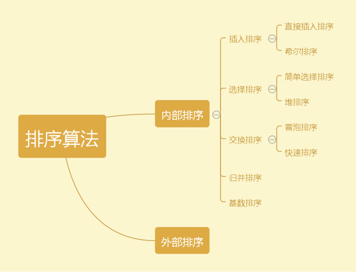
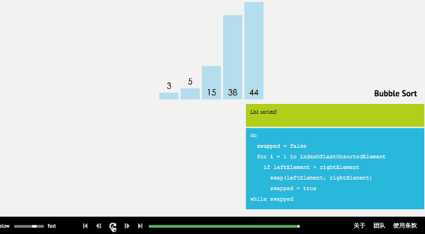

# 常见的八大排序算法

[参考博客1](https://www.jianshu.com/p/7d037c332a9d)

[参考博客2](http://blog.csdn.net/youzhouliu/article/details/52311443)

### 前言

- 常见的八大排序算法，他们之间关系如下：
- 他们的性能比较：


### 直接插入排序

- **基本思想：**
  - 先将序列的第1个记录看成是一个有序的子序列，然后从第2个记录逐个进行插入，直至整个序列有序为止。
- 直接插入排序示例：
- 如果碰见一个和插入元素相等的，那么插入元素把想插入的元素放在相等元素的后面。所以，相等元素的前后顺序没有改变，从原无序序列出去的顺序就是排好序后的顺序，**所以插入排序是稳定的。**
- **算法的实现：**

```c++
void InsertSort(int a[], int n)  
{  
    int x, j;
    for (int i = 1; i < n; i++) {
        j = i - 1; // 要插入元素的下标
        x = arr[i]; // 哨兵

       for( ; j>=0 && a[j+1]<a[j]; j--){
         a[j+1] = a[j];
       }
        
       a[j + 1] = x; // 插入到正确的位置
    }
}
```

- 其他的插入排序有二分插入排序，2-路插入排序。

### 插入排序—希尔排序

- 希尔排序又叫**缩小增量排序**。
- **基本思想：**
  - 将待排序数组按照步长gap进行分组，然后将每组的元素利用直接插入排序的方法进行排序；
  - 每次将gap折半减小，循环上述操作；
  - 当gap=1时，利用直接插入，完成排序。


```c++
public static void shellSortSmallToBig(int[] data) {
    int j = 0;
    int temp = 0;
    
    // increment每次少一半
    for (int increment = data.length / 2; increment > 0; increment /= 2) {
        // 从increment开始，每次+1
        for (int i = increment; i < data.length; i++) {
            temp = data[i];
            // 开始插入排序
            for (j = i - increment; j >= 0; j -= increment) {
                if (temp < data[j]) {
                    data[j + increment] = data[j];
                } else {
                    break;
                }
            }
            data[j + increment] = temp;
        }
    }
}
```

### 简单选择排序

- 算法思想：
  1. 从待排序序列中，找到关键字最小的元素；
  2. 如果最小元素不是待排序序列的第一个元素，将其和第一个元素互换；
  3. 从余下的个元素中，找出关键字最小的元素，重复步骤1、2，直到排序结束。


```c++
void selectSort(int a[], int n){  
    int key, tmp;  
    for(int i = 0; i< n; ++i) {  
        key = SelectMinKey(a, n, i);           //选择最小的元素  
        if(key != i){ 
            //最小元素与第i位置元素互换  
            tmp = a[i];  
            a[i] = a[key]; 
            a[key] = tmp;
        }  
        print(a,  n , i);  
    }  
} 

int SelectMinKey(int a[], int n, int i)  
{  
    int k = i;  
    for(int j= i+1;j< n; ++j) {  
        if(a[k] > a[j]) k = j;  
    }  
    return k;  
}  
```

### 堆排序

- 堆的概念：
  - 本质是一种数组对象。特别重要的一点性质：任意的叶子节点小于（或大于）它所有的父节点。
  - 对此，又分为大顶堆和小顶堆，大顶堆要求节点的元素都要大于其左右孩子，小顶堆要求节点元素都小于其左右孩子，两者对左右孩子的大小关系不做任何要求。
  - 利用堆排序，就是基于大顶堆或者小顶堆的一种排序方法。下面，我们通过大顶堆来实现。
- 堆排序可以按照以下步骤来完成：
  1. 首先将序列构建称为大顶堆；
  2. 取出当前大顶堆的根节点，将其与序列末尾元素进行交换；
  3. 对交换后的n-1个序列元素进行调整，使其满足大顶堆的性质；
- [具体实现](堆的相关算法.md)

### 冒泡排序

- 基本思想：
- 冒泡排序思路比较简单：
  1. 将序列当中的左右元素，依次比较，保证右边的元素始终大于左边的元素；
  2. 对序列当中剩下的n-1个元素再次执行步骤1。
  3. 对于长度为n的序列，一共需要执行n-1轮比较。

```c++
void bubbleSort(int a[], int n){  
    for(int i =0 ; i< n-1; ++i) {  
        for(int j = 0; j < n-i-1; ++j) {  
            if(a[j] > a[j+1])  
            {  
                int tmp = a[j]; 
                a[j] = a[j+1];
                a[j+1] = tmp;  
            }  
        }  
    }  
} 
```

##### **冒泡排序算法的改进**

- 对冒泡排序常见的改进方法是加入一标志性变量exchange，用于标志某一趟排序过程中是否有数据交换，如果进行某一趟排序时并没有进行数据交换，则说明数据已经按要求排列好，可立即结束排序，避免不必要的比较过程。
- 改进后算法如下：

```c++
void Bubble_1(int r[], int n) {  
    int i= n - 1;  //初始时,最后位置保持不变  
    while (i > 0) {   
        int pos = 0; //每趟开始时,无记录交换  
        for (int j= 0; j< i; j++)  
            if (r[j]> r[j+1]) {  
                pos= j; //记录交换的位置   
                int tmp = r[j];
                r[j]=r[j+1];
                r[j+1]=tmp;  
            }   
        i= pos; //为下一趟排序作准备  
     }   
}
```

### 快速排序

- **基本思想：**
  1. 选择一个基准元素，通常选择第一个元素或者最后一个元素。
  2. 通过一趟排序讲待排序的记录分割成独立的两部分，其中一部分记录的元素值均比基准元素值小。另一部分记录的元素值比基准值大。
  3. 此时基准元素在其排好序后的正确位置。
  4. 然后分别对这两部分记录用同样的方法继续进行排序，直到整个序列有序。
- 快速排序的示例：
  1. 一趟排序的过程：
  2. 排序的全过程：
- **算法的实现：**

```c++
void swap(int *a, int *b)  
{  
    int tmp = *a;  
    *a = *b;  
    *b = tmp;  
}  
  
int partition(int a[], int low, int high)  
{  
    //基准元素 
    int privotKey = a[low]; 
    //从表的两端交替地向中间扫描 
    while(low < high){              
        //从high所指位置向前搜索，至多到low+1 位置。将比基准元素小的交换到低端  
        while(low < high  && a[high] >= privotKey) --high;  
        swap(&a[low], &a[high]);  
        while(low < high  && a[low] <= privotKey ) ++low;  
        swap(&a[low], &a[high]);  
    }  
    return low;  
}  
  
  
void quickSort(int a[], int low, int high){  
    if(low < high){  
        int privotLoc = partition(a,  low,  high);  //将表一分为二  
        quickSort(a,  low,  privotLoc -1);          //递归对低子表递归排序  
        quickSort(a,   privotLoc + 1, high);        //递归对高子表递归排序  
    }  
}  
```

- **[快排的优化](http://blog.csdn.net/hacker00011000/article/details/52176100)：**
  1. 以“三者取中法”来选取基准记录：

     - 对待排序序列中low、mid、high三个位置上数据进行排序，取他们中间的那个数据作为枢轴。
     - 快速排序是通常被认为在同数量级（O(nlog2n)）的排序方法中平均性能最好的。
     - 但若初始序列按关键码有序或基本有序时，快排序反而蜕化为冒泡排序。
     - 为改进之，通常以“三者取中法”来选取基准记录，即将排序区间的两个端点与中点三个记录关键码居中的调整为支点记录。

  2. 只对长度大于k的子序列递归调用快速排序：

     - 小于k的子序列使用插入排序算法。
     - 实践证明，改进后的算法时间复杂度有所降低，且当k取值为 10 左右时,改进算法的性能最佳。

  3. 在一次分割结束后，可以把与Key相等的元素聚在一起，继续下次分割时，不用再对与key相等元素分割。

     - 具体过程：在处理过程中，会有两个步骤
       1. 第一步，在划分过程中，把与key相等元素放入数组的两端。
       2. 第二步，划分结束后，把与key相等的元素移到枢轴周围。

  4. 优化递归操作：

     - 快排函数在函数尾部有两次递归操作，我们可以对其使用尾递归优化。
     - 如果待排序的序列划分极端不平衡，递归的深度将趋近于n，而栈的大小是很有限的，每次递归调用都会耗费一定的栈空间，函数的参数越多，每次递归耗费的空间也越多。
     - 优化后，可以缩减堆栈深度，由原来的O(n)缩减为O(logn)，将会提高性能。

     ```c++
     void QSort(int arr[],int low,int high)  
     {   
         int pivotPos = -1;  
         if (high - low + 1 < 10)  
         {  
             InsertSort(arr,low,high);  
             return;  
         }  
         while(low < high)  
         {  
             pivotPos = Partition(arr,low,high);  
             QSort(arr,low,pivot-1);  
             low = pivot + 1;  
         }  
     } 
     ```

  5. 使用并行或多线程处理子序列。

- 快速排序是一个不稳定的排序方法。

### 归并排序

- 算法思想：
  - 归并（Merge）排序法是将两个（或两个以上）有序表合并成一个新的有序表，即把待排序序列分为若干个子序列，每个子序列是有序的。然后再把有序子序列合并为整体有序序列。
- 归并排序示例：

##### 归并的递归算法：

```Java
public static void sort(int []arr){
    int []temp = new int[arr.length];//在排序前，先建好一个长度等于原数组长度的临时数组，避免递归中频繁开辟空间
    sort(arr,0,arr.length-1,temp);
}
private static void sort(int[] arr,int left,int right,int []temp){
    if(left<right){
        int mid = (left+right)/2;
        sort(arr,left,mid,temp);//左边归并排序，使得左子序列有序
        sort(arr,mid+1,right,temp);//右边归并排序，使得右子序列有序
        merge(arr,left,mid,right,temp);//将两个有序子数组合并操作
    }
}
private static void merge(int[] arr,int left,int mid,int right,int[] temp){
    int i = left;//左序列指针
    int j = mid+1;//右序列指针
    int t = 0;//临时数组指针
    while (i<=mid && j<=right){
        if(arr[i]<=arr[j]){
            temp[t++] = arr[i++];
        }else {
            temp[t++] = arr[j++];
        }
    }
    while(i<=mid){//将左边剩余元素填充进temp中
        temp[t++] = arr[i++];
    }
    while(j<=right){//将右序列剩余元素填充进temp中
        temp[t++] = arr[j++];
    }
    t = 0;
    //将temp中的元素全部拷贝到原数组中
    while(left <= right){
        arr[left++] = temp[t++];
    }
}
```

- 优化：
  - 每次merge都需要将temp复制到arr，这样十分浪费时间。
  - 实际上当temp有序时，temp可以作为arr，arr可以作为temp，进行上一层的合并。

```Java
public static void sort(int[] arr) {
    int[] temp = new int[arr.length];//在排序前，先建好一个长度等于原数组长度的临时数组，避免递归中频繁开辟空间
    for (int i = 0; i < arr.length; i++) {
        temp[i] = arr[i];
    }
    sort(temp, 0, arr.length - 1, arr);
}

private static void sort(int[] arr, int left, int right, int[] temp) {
    if (left < right) {
        int mid = (left + right) / 2;
        sort(temp, left, mid, arr);//左边归并排序，使得左子序列有序
        sort(temp, mid + 1, right, arr);//右边归并排序，使得右子序列有序
        merge(arr, left, mid, right, temp);//将两个有序子数组合并操作
    }
}

private static void merge(int[] arr, int left, int mid, int right, int[] temp) {
    int i = left;//左序列指针
    int j = mid + 1;//右序列指针
    int t = left;//临时数组指针
    while (i <= mid && j <= right) {
        if (arr[i] <= arr[j]) {
            temp[t++] = arr[i++];
        } else {
            temp[t++] = arr[j++];
        }
    }
    while (i <= mid) {//将左边剩余元素填充进temp中
        temp[t++] = arr[i++];
    }
    while (j <= right) {//将右序列剩余元素填充进temp中
        temp[t++] = arr[j++];
    }
}
```

##### 归并的迭代算法

- 1个元素的表总是有序的。所以对n个元素的待排序列，每个元素可看成1个有序子表。对子表两两合并生成n/2个子表，所得子表除最后一个子表长度可能为1外，其余子表长度均为2。再进行两两合并，直到生成n个元素按关键码有序的表。

### 基数排序/基数排序

- 算法思想：
- 基数排序：通过序列中各个元素的值，对排序的N个元素进行若干趟的“分配”与“收集”来实现排序。
  - **分配**：我们将L[i]中的元素取出，首先确定其个位上的数字，根据该数字分配到与之序号相同的桶中。
  - **收集**：当序列中所有的元素都分配到对应的桶中，再按照顺序依次将桶中的元素收集形成新的一个待排序列L[ ]
  - 对新形成的序列L[]重复执行分配和收集元素中的十位、百位...直到分配完该序列中的最高位，则排序结束。