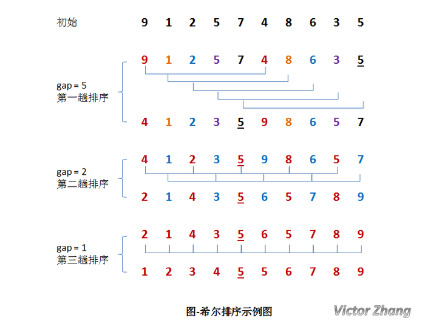
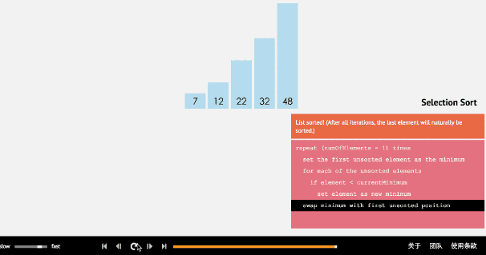
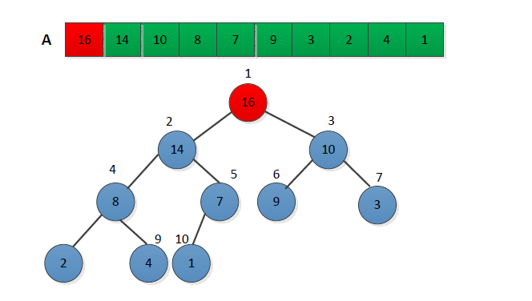
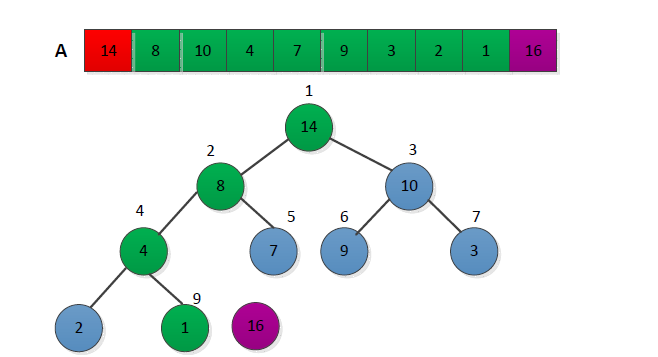

# 常见的八大排序算法

### [前言](https://www.jianshu.com/p/7d037c332a9d)

- 常见的八大排序算法，他们之间关系如下：
- 他们的性能比较：


### [实现(C++)](http://blog.csdn.net/youzhouliu/article/details/52311443)

#### 直接插入排序

- **基本思想：**
  - 先将序列的第1个记录看成是一个有序的子序列，然后从第2个记录逐个进行插入，直至整个序列有序为止。
- 直接插入排序示例：
- 如果碰见一个和插入元素相等的，那么插入元素把想插入的元素放在相等元素的后面。所以，相等元素的前后顺序没有改变，从原无序序列出去的顺序就是排好序后的顺序，**所以插入排序是稳定的。**
- **算法的实现：**

```c++
void InsertSort(int a[], int n)  
{  
    int x, j;
    for (int i = 1; i < n; i++) {
        j = i - 1; // 要插入元素的下标
        x = arr[i]; // 哨兵

       for( ; j>=0 && a[j+1]<a[j]; j--){
         a[j+1] = a[j];
       }
        
       a[j + 1] = x; // 插入到正确的位置
    }
}
```

- 其他的插入排序有二分插入排序，2-路插入排序。

#### 插入排序—希尔排序

- 希尔排序又叫**缩小增量排序**。
- **基本思想：**
  - 将待排序数组按照步长gap进行分组，然后将每组的元素利用直接插入排序的方法进行排序；
  - 每次将gap折半减小，循环上述操作；
  - 当gap=1时，利用直接插入，完成排序。



```c++
public static void shellSortSmallToBig(int[] data) {
    int j = 0;
    int temp = 0;
    
    // increment每次少一半
    for (int increment = data.length / 2; increment > 0; increment /= 2) {
        // 从increment开始，每次+1
        for (int i = increment; i < data.length; i++) {
            temp = data[i];
            // 开始插入排序
            for (j = i - increment; j >= 0; j -= increment) {
                if (temp < data[j]) {
                    data[j + increment] = data[j];
                } else {
                    break;
                }
            }
            data[j + increment] = temp;
        }
    }
}
```

### 简单选择排序

- 算法思想：
  1. 从待排序序列中，找到关键字最小的元素；
  2. 如果最小元素不是待排序序列的第一个元素，将其和第一个元素互换；
  3. 从余下的个元素中，找出关键字最小的元素，重复步骤1、2，直到排序结束。



```c++
void selectSort(int a[], int n){  
    int key, tmp;  
    for(int i = 0; i< n; ++i) {  
        key = SelectMinKey(a, n, i);           //选择最小的元素  
        if(key != i){ 
            //最小元素与第i位置元素互换  
            tmp = a[i];  
            a[i] = a[key]; 
            a[key] = tmp;
        }  
        print(a,  n , i);  
    }  
} 

int SelectMinKey(int a[], int n, int i)  
{  
    int k = i;  
    for(int j= i+1;j< n; ++j) {  
        if(a[k] > a[j]) k = j;  
    }  
    return k;  
}  
```

### 堆排序

- 堆的概念：

  - 本质是一种数组对象。特别重要的一点性质：任意的叶子节点小于（或大于）它所有的父节点。
  - 对此，又分为大顶堆和小顶堆，大顶堆要求节点的元素都要大于其左右孩子，小顶堆要求节点元素都小于其左右孩子，两者对左右孩子的大小关系不做任何要求。
  - 利用堆排序，就是基于大顶堆或者小顶堆的一种排序方法。下面，我们通过大顶堆来实现。

- 堆排序可以按照以下步骤来完成：

  1. 首先将序列构建称为大顶堆；
  2. 取出当前大顶堆的根节点，将其与序列末尾元素进行交换；
  3. 对交换后的n-1个序列元素进行调整，使其满足大顶堆的性质；

  [具体实现](堆的相关算法.md)

